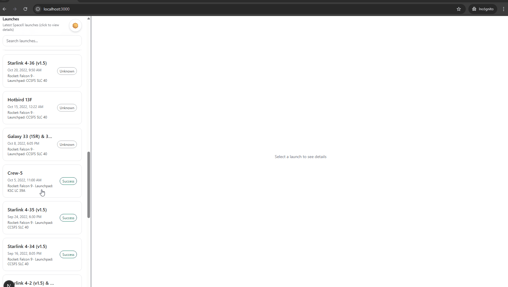
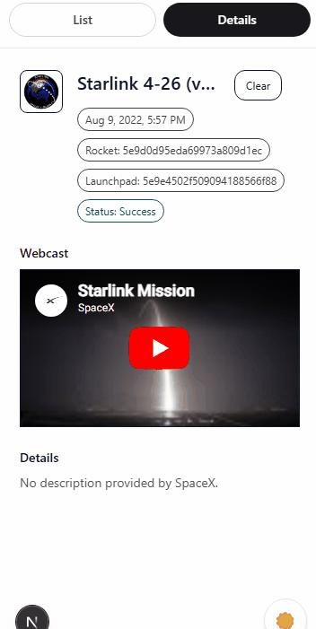

# SpaceX Mission Control — Finsphera Frontend Challenge

A production-minded dashboard to explore SpaceX launches through a sidebar + details panel experience.
The focus of this project is UX polish, resilience, and real-world frontend architecture rather than raw feature count.

## Live Demo
- Live URL: [https://finsphera-spacex.vercel.app/](https://finsphera-spacex.vercel.app/)
- Repo URL: [https://github.com/LeoTrujillo/finsphera-spacex](https://github.com/LeoTrujillo/finsphera-spacex)

---

## Screenshots

### Desktop


### Mobile


---


## Features
- Launches list with search and filtering
- Persistent details panel with mission patch, status, description, and webcast embed (when available)
- Loading, error and empty states (skeletons + retry actions)
- Deep linking via URL query params (`?launch=<id>`) with refresh and share support
- Responsive layout with List / Details toggle on mobile
- Dark mode with persisted user preference
- Virtualized launches list for better performance and scalability
- Keyboard accessible navigation (tab, enter/space, focus styles)

---

## Tech Stack
- Next.js (App Router)
- TypeScript (strict mode)
- Tailwind CSS
- TanStack React Query (data fetching, caching, retries)
- TanStack Virtual (list virtualization)
- Framer Motion (micro-interactions)
- Vitest + React Testing Library (basic coverage)

---
## Architecture & Folder Structure

**High-level approach:**  

The UI is split into layout and feature modules, while data fetching and caching are centralized to keep components focused and predictable.

```
finsphera-spacex/
├─ src/
│  ├─ app/
│  │  ├─ layout.tsx
│  │  ├─ page.tsx
│  │  └─ globals.css
│  ├─ components/
│  │  ├─ layout/
│  │  │  └─ AppLayout.tsx
│  │  ├─ launches/
│  │  │  ├─ LaunchDetailsPanel.tsx
│  │  │  ├─ LaunchSelectionContext.tsx
│  │  │  └─ LaunchesList.tsx
│  │  ├─ providers/
│  │  │  └─ ThemeProvider.tsx
│  │  └─ ui/
│  │     └─ ThemeToggle.tsx
│  ├─ lib/
│  │  ├─ spacex.tsx
│  │  ├─ format.ts
│  │  ├─ useLaunchDetails.tsx
│  │  └─ useLaunches.tsx
│  └─ types/
│     └─ launch.ts
├─ public/
│  └─ (assets)
├─ tests/
│  └─ (see src/__tests__)
├─ vitest.config.ts
└─ package.json
```


### Why React Query?
TanStack React Query is used to manage server state, caching, retries, and request lifecycle.  
This keeps UI components simple and resilient to API failures while reflecting common production patterns.

### Why URL-based selection?
Persisting the selected launch in the URL improves UX by allowing refresh-safe state, bookmarking, and sharing — behavior expected from real dashboards.

---

## Design Decisions
- **Sidebar + persistent details panel** instead of modals to encourage exploration.
- **Visual hierarchy first**: mission name, status, and date are prioritized over long descriptions.
- **Polish over volume**: fewer features implemented carefully rather than many shallow ones.

---

## AI Usage (Transparency)

I use AI as a productivity and reasoning tool, not as a replacement for implementation or decision-making.

My typical workflow is:
- I start by designing interfaces and TypeScript types manually.
- Once the initial structure is in place, I use AI tools (such as Codex) as a second pass to review typings, suggest improvements, or point out alternative approaches.
- Components are written from scratch. When refactoring is needed, I provide specific context and files so AI can help propose more maintainable and robust solutions.
- All generated code is carefully reviewed, adjusted, or rewritten when necessary.
- AI is also used to help debug issues and to generate initial test cases for components or features, which are then refined manually.

This approach helps me reduce time spent on repetitive or mechanical tasks while keeping full control over architecture, code quality, and final decisions.


---

## Challenges & Trade-offs
- SpaceX data can be incomplete or inconsistent; the UI handles missing fields gracefully.
- Virtualization adds complexity but significantly improves performance and scalability.
- Related entities (rocket, launchpad details) could be expanded further using additional API calls.


## Scalability Notes
If this application were to grow:
- Pagination or infinite scrolling could be introduced easily
- API calls could be routed through a backend or edge layer
- Monitoring, logging, and error tracking would be added
- Design system abstractions could be extracted from existing UI components

---

## Testing
Basic tests were added to validate filtering, details rendering, and deep-link behavior.

```
pnpm test
```
---

## Getting Started
```bash
pnpm install
pnpm dev
